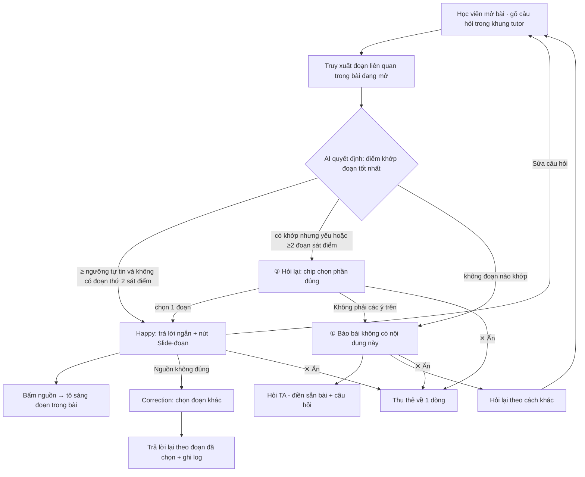

# AI SPEC — Tutor VLearn trả lời có căn cứ · Nhóm Toosweet · E403
Hướng: [x] A1 — VLearn Tutor  [ ] B — Trợ lý Học viên  [ ] C — Làn mở
Loại: [x] Tối ưu tính năng có sẵn  [ ] Tính năng mới

> Bản CP2: §4 và §6 mô tả mock có thể bấm thử. Các phần bằng chứng, rủi ro và kiểm thử tiếp tục được hoàn thiện trước mốc chốt spec CP4.

## §1. User & Job
- Job executor + workflow (đính kèm worksheet JTBD / ảnh sơ đồ):
- Core JTBD (không tên sản phẩm/AI trong câu):
- Problem statement (KHÔNG chữ AI):
- Evidence (chuẩn A và/hoặc B — log đầy đủ trong repo):
  - Số liệu mining / kết quả khảo sát (n = ?, % xác nhận):
  - ≥5 quote/ví dụ nguyên văn + nguồn:

## §2. Impact & quyết định chọn
- Bảng impact ≥3 ứng viên (bao nhiêu người · tần suất · tốn gì mỗi lần · khả thi):
- Ứng viên ĐÃ LOẠI + vì sao:
- Ứng viên CHỌN + vì sao (bằng số):

## §3. Giải pháp tương tự đã nghiên cứu
- [Sản phẩm 1]: flow / đáng học / đáng né / mình khác gì
- [Sản phẩm 2]: ...

## §4. Thiết kế
- Lát cắt MỘT CÂU (1 user · 1 việc · 1 quyết định AI · 1 kết quả): Một học viên đang mở bài trên VLearn hỏi về một khái niệm trong bài; AI quyết định bài đang mở có đủ đoạn liên quan để trả lời hay không; học viên nhận giải thích ngắn kèm mã slide/đoạn bấm tới được, hoặc câu hỏi làm rõ, hoặc lời báo "bài không có nội dung này" kèm nút hỏi TA.
- Non-goals (≥3 thứ KHÔNG build):
  1. Không trả lời kiến thức ngoài bài đang mở (không tìm web, không lấy bài khác của khoá).
  2. Không chấm bài, không sinh quiz, không làm bài tập hộ.
  3. Không nhớ lịch sử hỏi qua nhiều buổi / không cá nhân hoá theo học viên.
  4. Không build hệ thống TA thật — nút "Hỏi TA" chỉ điền sẵn tin nhắn.
- Mức prototype nhắm tới: [ ] Sketch [x] Mock [ ] Working — `prototype/index.html` (trang HTML tĩnh, mở bằng trình duyệt, bấm thử được cả 4 đường đi):
  | Thành phần | CP2 (hiện tại) | Kế hoạch CP3 |
  |---|---|---|
  | Giao diện bài học + khung tutor, bấm nguồn nhảy tới đoạn | **Thật** (chạy trong trình duyệt) | Giữ nguyên |
  | Rẽ nhánh 4 đường (happy / ② / ① / correction) + ngưỡng quyết định | **Logic chạy trong trình duyệt** trên điểm khớp từ khoá giả lập, chưa phải quyết định của model | Giữ luồng, thay điểm giả lập bằng kết quả truy xuất thật |
  | Truy xuất đoạn liên quan | **Giả lập** — khớp từ khoá trên 8 đoạn của 4 slide mẫu (Bài 7: RAG cơ bản) | Embedding + cosine similarity trên slide thật |
  | Câu trả lời của AI | **Giả lập** — viết sẵn cho từng đoạn | Gọi model thật, prompt ép chỉ dùng đoạn truy xuất được |
  | Gửi TA, ghi correction log | **Giả lập** — hiện form và trace chỉ trong phiên trình duyệt, không gửi hay lưu ra file | Ghi log correction ra file để đưa vào golden set |
- Automation: [ ] augment [x] conditional [ ] automate — lý do theo cost-of-error:
  - **Sai thì ai chịu gì:** học viên chịu. Giải thích sai khái niệm → học viên hiểu sai, mang lỗi vào bài tập/bài kiểm tra; học viên đang *chưa hiểu* nên gần như không tự phát hiện được → sửa rất đắt (học lại, mất điểm). Vì vậy **không Automate** (không cho AI trả lời mọi câu, kể cả khi không có căn cứ).
  - **Vì sao không Augment:** nếu mỗi câu trả lời đều chờ TA duyệt, học viên đợi hàng giờ cho câu hỏi mà slide đã trả lời sẵn — đúng pain đang có (12/17 người phải tự mở slide/hỏi công cụ khác). Chi phí chờ đó lớn hơn rủi ro ở case có căn cứ.
  - **Vì sao Conditional đúng:** case có căn cứ là case "lành" — câu trả lời kèm slide/đoạn bấm tới được, học viên tự đối chiếu trong vài giây, nên nếu sai cũng rẻ để phát hiện. Case "hiểm" là câu mơ hồ (khớp nhiều phần) và câu không có trong bài — ở đó AI không đoán: hỏi lại (②) hoặc báo thiếu căn cứ + chuyển TA (①).
- §4b. Nguyên tắc đã áp dụng (≥4 — HAX/PAIR, xem guide):
  | Nguyên tắc | Áp cụ thể vào đâu trong prototype |
  |---|---|
  | **HAX G10 — Scope services when in doubt** (bắt buộc) | (a) Khi điểm khớp < ngưỡng tự tin hoặc đoạn thứ 2 đạt ≥80% đoạn đầu (bấm thử "Similarity là gì?"): khung vàng "Chưa chắc bạn hỏi phần nào", **không trả lời**, chỉ đưa 2–3 chip "Cosine similarity (Slide 3 · đoạn 2)" / "Ngưỡng similarity (Slide 4 · đoạn 2)". (b) Khi không có đoạn nào khớp (bấm "LoRA cần bao nhiêu GPU?"): khung đỏ "Bài đang mở không có nội dung này", thu phạm vi về hỏi TA / hỏi lại, không sinh câu trả lời. |
  | **HAX G11 — Make clear why the system did what it did** | Mỗi câu trả lời xanh có nút nguồn `📄 Slide 3 · đoạn 1` — bấm thì panel bài học cuộn tới và tô vàng đúng đoạn; mục mở rộng "Vì sao có câu trả lời này?" trích nguyên văn đoạn nguồn + điểm khớp so với ngưỡng. Khung ②/① cũng nói rõ lý do không trả lời ("để tránh giải thích nhầm/đoán sai"). |
  | **HAX G9 — Support efficient correction** | Dưới mỗi câu trả lời: nút "Nguồn không đúng" → hiện danh sách các đoạn khác trong bài, học viên chọn 1 đoạn → mock minh hoạ câu trả lời theo đoạn đó và cho thấy chính đoạn nguồn để kiểm tra; câu trả lời cũ bị gạch mờ. Nút "Sửa câu hỏi" đưa câu cũ về ô nhập. Correction hiện trong trace của phiên, chưa được lưu thành golden set. |
  | **HAX G8 — Support efficient dismissal** | Mọi thẻ của tutor (câu trả lời, câu hỏi làm rõ, sửa nguồn, báo thiếu căn cứ) có nút "✕ Ẩn/Bỏ qua" 1 chạm, thu thẻ về 1 dòng mờ; câu hỏi làm rõ có thêm "Không phải các ý trên" để thoát khỏi gợi ý sai. |

## §5. Kiểu lỗi — 4 lớp chỗ khó + kịch bản (≥8) [bảng theo guide §2.5]

## §6. Bốn đường đi của trải nghiệm
Luồng chung (thử trong `prototype/index.html`; bấm "Xem quyết định AI" để thấy điểm khớp và nhánh được chọn):

- **Happy path** — *"Embedding là gì?"*: có 1 đoạn khớp rõ (Slide 3 · đoạn 1, điểm 4 ≥ ngưỡng 2) → khung xanh "Có căn cứ trong bài" + 2 câu giải thích + nút `📄 Slide 3 · đoạn 1` → học viên bấm, bài cuộn tới và tô vàng đoạn đó để đối chiếu. Kết thúc: học viên bấm 👍 hoặc tiếp tục đọc.
- **Low-confidence (②)** — *"Similarity là gì?"*: 2 đoạn ở 2 slide khớp ngang nhau (cosine similarity ở Slide 3, ngưỡng similarity ở Slide 4) → AI **không trả lời**, khung vàng "Chưa chắc bạn hỏi phần nào" + chip chọn. Chọn chip → vào happy path với đoạn đó. "Không phải các ý trên" → chuyển sang ①. Kết thúc: có câu trả lời đúng phần hoặc chuyển TA.
- **Failure / không căn cứ (①)** — *"LoRA fine-tuning cần bao nhiêu GPU?"*: không đoạn nào trong bài khớp → khung đỏ "Bài đang mở không có nội dung này… không trả lời để tránh đoán sai". Lựa chọn: "Hỏi TA" (form điền sẵn tên bài, slide, câu hỏi, lý do tutor không trả lời) hoặc "Hỏi lại theo cách khác". Kết thúc: câu hỏi đã sang TA, hoặc học viên hỏi lại.
- **Correction (user sửa)** — *"Vì sao cần chia nhỏ tài liệu?"* → có câu trả lời kèm Slide 2 · đoạn 1 → học viên bấm "Nguồn không đúng" → chọn đoạn khác (vd. Slide 2 · đoạn 2 Overlap) → câu trả lời cũ bị thu mờ, mock minh hoạ câu trả lời viết sẵn theo đoạn mới và cho mở đoạn nguồn để đối chiếu. Trace chỉ ghi sự kiện trong phiên, chưa lưu ra file. Hoặc "Sửa câu hỏi" → câu cũ về ô nhập để sửa và hỏi lại.
- Khi bị đòi ngoài phạm vi (③): · Case đặc thù domain (④):

## §7. Kiểm thử
- Chiều chất lượng + định nghĩa kiểm chứng được:
- Golden set (≥20 case theo cơ cấu trong guide §2.6, file trong eval/):
- Quality bar (chốt từ hạn chốt spec của khoá, giữ nguyên sau đó): "Đạt khi ≥ ___% qua bộ, và ___"
- Kết quả các lượt chạy (bảng % — cập nhật đến trước CP6):

## §8. Phân công & kế hoạch
- Phân công hiện ghi trong README nhóm: Phạm Long Nhật — spec, prompt và tiêu chí đủ căn cứ; Nguyễn Tiến Lượng — prototype, gọi model ở CP3 và user test; Lê Thanh Tình — mining evidence và demo. Phần golden set/eval cần nhóm phân công rõ trước CP3.
- Willing users (≥2 tên) + kế hoạch vòng validation *(bonus, nếu làm)*:
- Multi-prototype (nếu làm): trục khác biệt của ≥2 phương án + lý do chọn:

## §9. Changelog
| Thời điểm | Đổi gì | Vì sao (trỏ về feedback/case nào) |
|---|---|---|
| 17/9 · CP2 | Điền §4 (mức Mock, conditional theo cost-of-error, §4b G10/G11/G9/G8) và §6 (4 đường đi + sơ đồ luồng); thêm `prototype/index.html` | Checkpoint CP2: kiểm tra luồng trước khi nối model thật |
